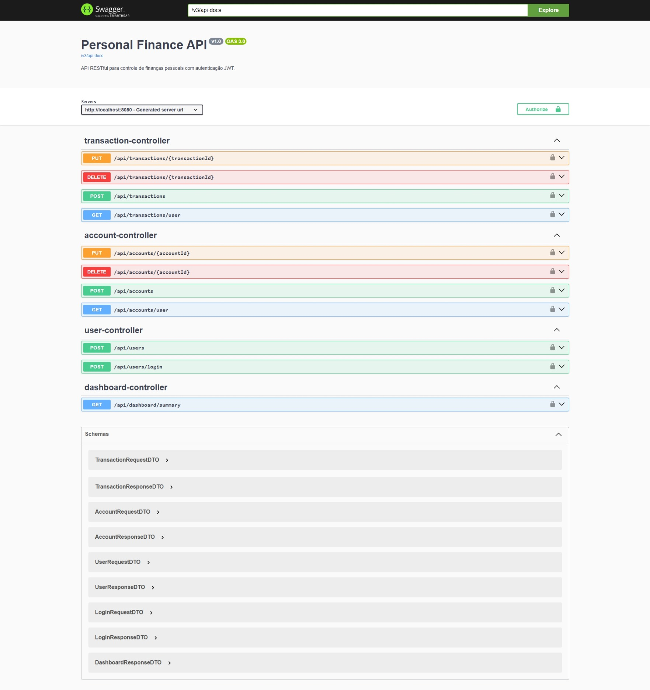

# Personal Finance API 💰

A production-ready RESTful API designed for personal finance control and budgeting. This project implements industry-standard architectural best practices, stateless authentication with Spring Security and JWT, and automated database versioning.

The backend is fully containerized with Docker, working seamlessly alongside the database and frontend ecosystem.

## 🖼️ Preview

<table>
  <tr>
    <td align="center"><strong>Frontend Dashboard</strong></td>
    <td align="center"><strong>Backend Swagger UI</strong></td>
  </tr>
  <tr>
    <td></td>
    <td></td>
  </tr>
</table>

---

## 🚀 Technologies Used

* **Java 21** & **Spring Boot 3**
* **Spring Security** & **JWT (JSON Web Tokens)** (Stateless Authentication)
* **Spring Data JPA** & **PostgreSQL** (Relational Database)
* **Flyway** (Database migrations and schema versioning)
* **Springdoc OpenAPI 3 (Swagger)** (Interactive API Documentation)
* **Lombok** & **Jakarta Validation**
* **JUnit 5**, **Mockito** & **AssertJ** (Robust testing stack)

---

## 📐 Architecture & Best Practices

* **DTO Pattern:** Complete isolation between database entities and network payloads, preventing mass-assignment vulnerabilities.
* **Security & Multi-Tenancy:** Logged-in user identification is retrieved securely from the Spring Security context (`@AuthenticationPrincipal`), ensuring a user can never access, update, or delete accounts and transactions belonging to another tenant.
* **Defensive Programming:** Implements rigorous data validation (`@Valid`) and explicit boundary/null handling for financial aggregation metrics.
* **Database Evolution:** Schema structures (`tb_users`, `tb_accounts`, `tb_transactions`) are strictly managed through Flyway migration scripts, ensuring zero synchronization issues.

---

## ⚙️ Environment Variables

The application relies on the following environment variables for configuration (configured in the `docker-compose.yml` file):

| Variable | Description | Default Value |
| :--- | :--- | :--- |
| `DB_URL` | PostgreSQL connection JDBC URL | `jdbc:postgresql://localhost:5432/finance_db` |
| `DB_USER` | Database username | `postgres` |
| `DB_PASSWORD` | Database password | `root` |
| `JWT_SECRET` | Secret key used to sign and verify JWT tokens | `my-secret-key` |
| `ALLOWED_ORIGINS` | Allowed frontend URL for CORS protection | `http://localhost` |

---

## 📦 How to Run

### Prerequisites
* Docker and Docker Compose installed.

### Execution Steps

Clone the projects, keeping them in the following structure. The docker-compose.yml file will look for the personal-finance-web folder one level above the backend folder.

```sh
mkdir personal-finance-app
cd personal-finance-app
git clone https://github.com/GuilhermeRBLC/personal-finance-api.git
git clone https://github.com/GuilhermeRBLC/personal-finance-web.git
```

```bash
📁 personal-finance-app/              # Root Directory
├── 📁 personal-finance-api/          # ☕ BACKEND (Spring Boot API)
│    └── 📄 docker-compose.yml        # 🐳 Ecosystem Orchestrator (Database + Back + Front)
└── 📁 personal-finance-web/          # 🅰️ FRONTEND (Angular Web App)
```

To spin up the database and the backend API together, navigate to the project root directory where the `docker-compose.yml` is located and run:

```bash
docker-compose up -d --build
```

The server will initialize, Flyway will apply migrations automatically, and the API will be available at http://localhost:8080.

The frontend container will build, compile the Angular application, and expose the interface at http://localhost (or http://localhost:4200 depending on your compose configuration) 🚀.

To stop everything.

```bash
docker-compose down
```

## 📖 API Documentation (Swagger)
Once the application is running, you can explore and test the endpoints interactively via Swagger UI:

🔗 http://localhost:8080/swagger-ui/index.html

## 🧪 Testing Suite
We maintain a high-quality test suite using JUnit 5, Mockito, and AssertJ focused on sealing business logic rules against unexpected behaviors.

What is covered:
- UserService: Validates secure password hashing, unique email enforcement, and end-to-end JWT generation/validation.

- AccountService & TransactionService: Guarantees core multi-tenant security blocks (preventing unauthorized cross-user modifications) and precise balance updates using BigDecimal.

- DashboardService: Assures smooth, null-safe conversions when building metrics for users without a financial history.

To run the unit tests locally via Maven, execute:

```bash
mvn test
```

---
